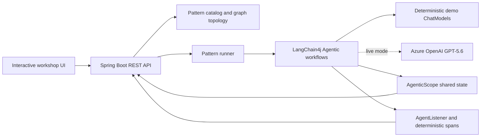
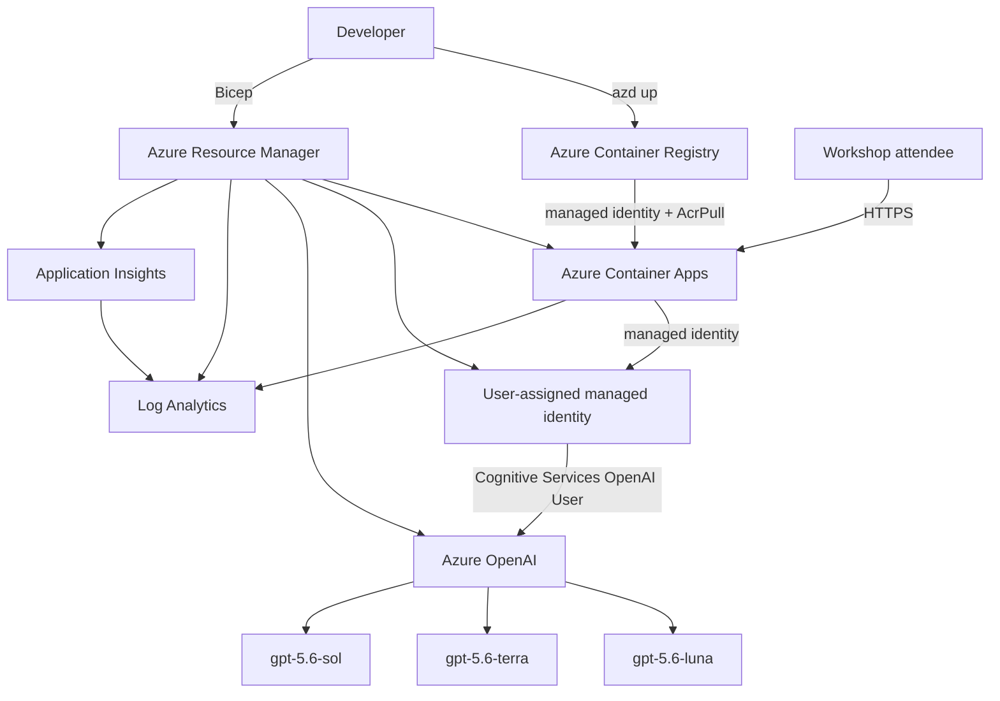

# TokenFlow Lab

**An interactive LangChain4j Agentic workshop for designing AI flows that spend tokens deliberately.**

TokenFlow Lab turns eight token-efficiency patterns into runnable workflows, animated execution graphs, shared-state inspection, and honest token/latency measurements. It is designed for live developer sessions: every pattern has a sample prompt, visual trace, teaching notes, and a deterministic credential-free mode.

> The application runs offline by default. Demo mode uses the real LangChain4j Agentic orchestration runtime with deterministic local model responses. Live mode uses Azure OpenAI GPT-5.6 through managed identity.

## Contents

- [Why this lab exists](#why-this-lab-exists)
- [Patterns](#patterns)
- [Quick start](#quick-start)
- [Execution modes](#execution-modes)
- [Workshop walkthrough](#workshop-walkthrough)
- [Application architecture](#application-architecture)
- [Azure architecture](#azure-architecture)
- [Deploy with azd](#deploy-with-azd)
- [Operate the Azure deployment](#operate-the-azure-deployment)
- [Metrics and claims](#metrics-and-claims)
- [HTTP API](#http-api)
- [Project layout](#project-layout)
- [Testing](#testing)
- [Troubleshooting](#troubleshooting)
- [Versions](#versions)

## Why this lab exists

Agent cost is not solved by one prompt trick. It is an architecture concern involving model selection, context boundaries, deterministic computation, reuse, concurrency, and observability.

This lab helps developers answer four questions for each pattern:

1. **What work should invoke a model at all?**
2. **Which model tier is sufficient for that work?**
3. **What is the smallest useful context for the call?**
4. **What evidence proves the optimization did not reduce quality?**

The UI makes the trade-offs visible:

- animated SVG execution topology;
- model and non-AI agent spans;
- `AgenticScope` state passed between agents;
- provider token usage in live mode;
- projected baseline versus observed tokens;
- cache-hit and concurrency behavior;
- pattern-specific cautions and validation metrics.

## Patterns

| # | Pattern | LangChain4j implementation | Primary lesson | Validate with |
|---:|---|---|---|---|
| 1 | Router | `sequenceBuilder()` + `conditionalBuilder()` | Send work to the least expensive capable specialist | Routing accuracy and fallback rate |
| 2 | Triage | Non-AI `@Agent` + conditional workflow | Escalate only genuinely complex requests | Escalation precision and task success |
| 3 | Context compression | Sequential workflow | Give expensive reasoning a compact working set | Compression fidelity and tokens per turn |
| 4 | RAG | Non-AI retriever + grounded generator | Retrieve relevant chunks instead of sending the corpus | Retrieval recall and groundedness |
| 5 | Tool use | Deterministic calculator + explainer | Keep exact computation outside the model | Tool correctness and failure handling |
| 6 | Step-back planning | Planner + executor sequence | Reduce wandering and costly retries | Rework avoided and completion rate |
| 7 | Caching | Lookup agent + conditional miss path | A cache hit makes zero model calls | Hit rate, freshness, and tenant isolation |
| 8 | Batching | `parallelMapperBuilder()` | Improve throughput with bounded concurrency | Wall time, throughput, and throttling |

Batching does **not** inherently reduce content tokens. The lab reports it as a throughput pattern rather than claiming token savings.

## Quick start

### Prerequisites

- Java 21 or later
- No model credentials for demo mode
- Maven is optional because the wrapper is included

### Windows PowerShell

```powershell
.\mvnw.cmd spring-boot:run
```

### macOS or Linux

```bash
./mvnw spring-boot:run
```

Open [http://localhost:8080](http://localhost:8080), select a pattern, and choose **Run pattern**. Use <kbd>Ctrl</kbd>+<kbd>Enter</kbd> or <kbd>⌘</kbd>+<kbd>Enter</kbd> to run from the prompt editor.

## Execution modes

### Demo mode

Demo mode is deterministic, fast, and credential-free. It is ideal for presentations because:

- the orchestration is real LangChain4j Agentic code;
- only the external model response is simulated;
- routes and outputs are repeatable;
- token usage is estimated at approximately four characters per token;
- all eight patterns work without network access.

### Live mode

Live mode uses three Azure OpenAI deployments as explicit cost/capability tiers:

| Application tier | Azure deployment | Intended work |
|---|---|---|
| Small | `gpt-5.6-luna` | Routing, triage, compression, and concise tasks |
| Medium | `gpt-5.6-terra` | Standard specialist and batch work |
| Large | `gpt-5.6-sol` | Architecture and deeper reasoning |

The deployed Container App authenticates with a user-assigned managed identity. No Azure OpenAI key is stored in Bicep, Container Apps, or the browser.

For local live-mode testing, grant the signed-in developer `Cognitive Services OpenAI User`, sign in with Azure CLI, and set:

```powershell
az login
$env:AZURE_OPENAI_ENDPOINT="https://your-resource.openai.azure.com/"
$env:AZURE_OPENAI_USE_MANAGED_IDENTITY="true"
$env:TOKEN_PATTERNS_SMALL_MODEL="gpt-5.6-luna"
$env:TOKEN_PATTERNS_MEDIUM_MODEL="gpt-5.6-terra"
$env:TOKEN_PATTERNS_LARGE_MODEL="gpt-5.6-sol"
.\mvnw.cmd spring-boot:run
```

An API key remains available as a local fallback by setting `OPENAI_API_KEY` and leaving `AZURE_OPENAI_USE_MANAGED_IDENTITY=false`. Keys are server-side only and are never returned by `/api/config`.

## Workshop walkthrough

A suggested 25–35 minute session:

1. **Router** — use a Java question, then an architecture question. Show that only the selected specialist executes.
2. **Triage** — compare the zero-token deterministic gate with the model responder it activates.
3. **Context compression** — inspect `compactContext` and show that the large model never receives the complete incident transcript.
4. **RAG** — compare two retrieved chunks with the complete local corpus.
5. **Tool use** — show that Java performs exact arithmetic while the model only explains the verified result.
6. **Step-back planning** — discuss paying for a short plan to avoid expensive retries and option churn.
7. **Caching** — run the exact prompt twice. The second run should report a cache hit and zero model calls.
8. **Batching** — send three semicolon-separated requests. Compare elapsed time with token count and reinforce that concurrency is not token reduction.
9. **Challenge the baseline** — replace every projection with provider telemetry and production quality measurements.

## Application architecture



Each HTTP request creates a new workflow and trace collector. Agent outputs are written to `AgenticScope` keys such as `route`, `compactContext`, `plan`, `context`, and `answer`; downstream agents consume those keys by name.

## Azure architecture



The Bicep deployment creates:

| Resource | Configuration |
|---|---|
| Azure Container App | External HTTPS ingress, port 8080, 0–2 replicas, health probes |
| Container Apps environment | Consumption-only environment with Log Analytics |
| Azure Container Registry | Basic SKU, admin credentials disabled |
| User-assigned managed identity | Shared by ACR image pull and model access |
| Azure OpenAI | Local authentication disabled; managed identity required |
| GPT-5.6 deployments | Version `2026-07-09`, `GlobalStandard`, capacity 10 each |
| Log Analytics | 30-day retention |
| Application Insights | Workspace-based telemetry resource |

The managed identity receives only:

- `AcrPull` scoped to the registry;
- `Cognitive Services OpenAI User` scoped to the Azure OpenAI account.

The deployment principal can optionally receive `Cognitive Services OpenAI User` for local smoke testing by setting `AZURE_PRINCIPAL_ID`.

## Deploy with azd

### Azure prerequisites

- Azure CLI authenticated with `az login`
- Azure Developer CLI authenticated with `azd auth login`
- Permission to create resource groups, role assignments, Container Apps, ACR, monitoring resources, and Azure OpenAI deployments
- GPT-5.6 model availability and quota in the selected region

The verified dev target uses East US 2. Before choosing a different region, check all three models and the subscription quota:

```powershell
$subscriptionId = az account show --query id -o tsv

az cognitiveservices model list `
  --subscription $subscriptionId `
  --location eastus2 `
  --query "[?model.name=='gpt-5.6-luna' || model.name=='gpt-5.6-terra' || model.name=='gpt-5.6-sol'].{name:model.name,version:model.version,skus:model.skus[].name}" `
  --output table

az cognitiveservices usage list `
  --subscription $subscriptionId `
  --location eastus2 `
  --query "[?contains(name.value, 'gpt-5.6')].{name:name.value,current:currentValue,limit:limit}" `
  --output table
```

### First deployment

```powershell
az login
azd auth login

$subscriptionId = az account show --query id -o tsv
$principalId = az ad signed-in-user show --query id -o tsv

azd env new dev --subscription $subscriptionId --location eastus2
azd env set AZURE_RESOURCE_GROUP rg-tokenflow-dev
azd env set AZURE_PRINCIPAL_ID $principalId

# Optional, but recommended before applying changes
azd provision --preview --no-prompt

# Provision, remotely build in ACR, and deploy
azd up --no-prompt
```

Remote ACR builds mean local Docker is not required. The multi-stage `Dockerfile` compiles with Java 21 and runs as a non-root user.

### Useful outputs

```powershell
azd env get-values
azd env get-value AZURE_CONTAINER_APP_URL
azd env get-value AZURE_OPENAI_ENDPOINT
```

The verified dev deployment URL is:

`https://ca-tokenflow-dev-ozhotol5yje76.greenisland-6c1059fd.eastus2.azurecontainerapps.io/`

The dev Container App may be intentionally stopped. A `404` from this URL with no active revision is expected; use the start procedure below.

## Operate the Azure deployment

The examples derive names from the current azd environment instead of hard-coding them.

### Show status

```powershell
$resourceGroup = azd env get-value AZURE_RESOURCE_GROUP
$app = azd env get-value AZURE_CONTAINER_APP_NAME

az containerapp show `
  --resource-group $resourceGroup `
  --name $app `
  --query "{provisioning:properties.provisioningState,fqdn:properties.configuration.ingress.fqdn,latestRevision:properties.latestRevisionName}" `
  --output table

az containerapp revision list --all `
  --resource-group $resourceGroup `
  --name $app `
  --output table
```

### Stop serving the app without deleting resources

The current Container Apps CLI has no app-level `stop` command. Deactivate the active revision:

```powershell
$resourceGroup = azd env get-value AZURE_RESOURCE_GROUP
$app = azd env get-value AZURE_CONTAINER_APP_NAME
$revision = az containerapp revision list `
  --resource-group $resourceGroup `
  --name $app `
  --query "[?properties.active].name | [0]" `
  --output tsv

if ($revision) {
  az containerapp revision deactivate `
    --resource-group $resourceGroup `
    --name $app `
    --revision $revision
}
```

This stops the replicas and endpoint traffic but preserves the Container App, ACR image, identity, logs, and GPT-5.6 deployments.

### Start the stopped revision without rebuilding

```powershell
$resourceGroup = azd env get-value AZURE_RESOURCE_GROUP
$app = azd env get-value AZURE_CONTAINER_APP_NAME
$revision = az containerapp revision list --all `
  --resource-group $resourceGroup `
  --name $app `
  --query "sort_by(@, &properties.createdTime)[-1].name" `
  --output tsv

az containerapp revision activate `
  --resource-group $resourceGroup `
  --name $app `
  --revision $revision
```

### Deploy code changes

```powershell
azd deploy web --no-prompt
```

### Reconcile infrastructure and deploy

```powershell
azd up --no-prompt
```

### View application logs

```powershell
$resourceGroup = azd env get-value AZURE_RESOURCE_GROUP
$app = azd env get-value AZURE_CONTAINER_APP_NAME

az containerapp logs show `
  --resource-group $resourceGroup `
  --name $app `
  --type console `
  --tail 100 `
  --format text
```

### Delete the Azure environment

Stopping the revision does not delete ACR storage, logs, Azure OpenAI deployments, or other resources. To remove the full environment:

```powershell
azd down --purge --force --no-prompt
```

Review the target subscription and environment before running this destructive command.

## Metrics and claims

- **Observed tokens** are read from each `ChatResponse`. Demo mode estimates usage; live mode uses Azure OpenAI response usage.
- **Modeled baseline** is the projected cost of an equivalent monolithic large-model or repeated full-context path. It is not provider billing data.
- **Avoided tokens** equal the modeled baseline minus observed tokens.
- **Caching** claims no savings on the first miss and 100% model-token avoidance only on an exact hit.
- **Batching** reports zero content-token savings. Its primary measurements are elapsed time and concurrency.
- **Tool use** may improve correctness and auditability even when immediate token savings are modest.
- **Step-back planning** should be evaluated through retries and rework avoided, not just tokens in one request.

For production decisions, pair token telemetry with task success, latency, routing accuracy, retrieval recall, groundedness, cache freshness, and provider cost data.

## HTTP API

| Method | Path | Purpose |
|---|---|---|
| `GET` | `/api/patterns` | Pattern descriptions and graph definitions |
| `GET` | `/api/config` | Runtime capabilities and live model names; never returns secrets |
| `POST` | `/api/runs` | Execute one pattern in `demo` or `live` mode |
| `DELETE` | `/api/cache` | Clear the in-memory workshop response cache |

Example request:

```json
{
  "patternId": "router",
  "input": "Why does my Java stream return an empty list after I add a filter?",
  "mode": "demo"
}
```

PowerShell smoke test:

```powershell
$baseUrl = "http://localhost:8080"
$body = @{
  patternId = "triage"
  input = "What does HTTP 429 mean?"
  mode = "demo"
} | ConvertTo-Json

Invoke-RestMethod `
  -Uri "$baseUrl/api/runs" `
  -Method Post `
  -ContentType "application/json" `
  -Body $body
```

## Project layout

```text
.
├── azure.yaml                         # azd service and Bicep configuration
├── Dockerfile                         # Java 21 multi-stage non-root image
├── infra/
│   ├── main.bicep                     # Subscription-scope entry point and outputs
│   ├── main.parameters.json           # azd environment parameter mapping
│   └── resources.bicep                # Container Apps, ACR, identity, monitoring, models
├── src/main/java/com/example/tokenpatterns/
│   ├── agent/
│   │   ├── DemoChatModel.java         # Deterministic workshop model
│   │   ├── ModelCatalog.java          # Demo/Azure model selection and authentication
│   │   └── PatternAgents.java         # AI and non-AI agent definitions
│   ├── domain/                        # API records and graph definitions
│   ├── service/
│   │   ├── PatternCatalog.java        # Pattern content and topology
│   │   ├── PatternRunner.java         # Agentic workflow composition
│   │   └── TraceCollector.java        # Model callbacks and non-AI spans
│   └── web/PatternController.java     # REST API
├── src/main/resources/static/
│   └── index.html                     # Responsive, dependency-free interactive UI
└── src/test/java/                     # Catalog, workflow, cache, batch, and API tests
```

## Testing

Run the complete suite:

```powershell
.\mvnw.cmd test
```

Run a clean package build before deployment:

```powershell
.\mvnw.cmd clean package
```

The test suite executes all eight demo workflows, validates the API, confirms that a repeated cache request makes zero model calls, and checks parallel mapper fan-out.

## Troubleshooting

### Live mode is disabled

`/api/config` enables live mode only when `AZURE_OPENAI_ENDPOINT` is set and either managed identity or an API key is configured. In Azure, verify the Container App environment variables and identity assignment.

### Azure OpenAI returns 401 or 403

- Confirm `AZURE_OPENAI_USE_MANAGED_IDENTITY=true`.
- Confirm `AZURE_CLIENT_ID` references the assigned user-managed identity.
- Confirm the identity has `Cognitive Services OpenAI User` on the Azure OpenAI account.
- Allow several minutes for a new role assignment to propagate.

### A GPT-5.6 request returns a transient 500

Retry once, then inspect Container App logs. During validation, Luna, Terra, and Sol all completed live managed-identity requests; one Sol request returned a transient provider 500 before succeeding on retry.

### The endpoint returns 404 after the app was stopped

This is expected when no revision is active. List inactive revisions with `az containerapp revision list --all` and activate the latest revision using the start procedure above.

### Model deployment reports `RequestConflict`

Azure OpenAI can reject simultaneous operations on child model deployments. The Bicep file intentionally serializes Luna → Terra → Sol with `dependsOn`; preserve that ordering.

### Container Apps rejects `workloadProfileName`

This template creates a consumption-only environment. Do not set a workload profile name unless the environment is changed to use workload profiles.

### Remote ACR build differs from a local Maven build

The remote builder starts from an empty dependency cache and reveals missing optional dependencies. Keep `azure-identity` explicit because it is optional in the LangChain4j Azure OpenAI module but required by `DefaultAzureCredential`.

### An error includes both a Client Request ID and GH Request ID

That response is from the GitHub Copilot request layer, not the TokenFlow Container App. TokenFlow API failures are returned from `/api/runs` and appear in Container App console logs.

## Cost and cleanup

- The Container App is configured with `minReplicas: 0`, so idle compute can scale to zero.
- Deactivating its only revision stops serving requests and container compute.
- ACR image storage, retained logs, and other provisioned resources can still incur charges while the app is stopped.
- Azure OpenAI usage is driven by model calls; keep live mode off during a credential-free workshop when model responses are not needed.
- Use `azd down --purge --force --no-prompt` when the complete environment is no longer required.

## Versions

- Java 21
- Spring Boot 4.1.0
- LangChain4j 1.17.2
- LangChain4j Agentic 1.17.2-beta27
- GPT-5.6 model version 2026-07-09

The Agentic module is experimental and can change between releases. Keep it pinned and rerun the full test suite during upgrades.
