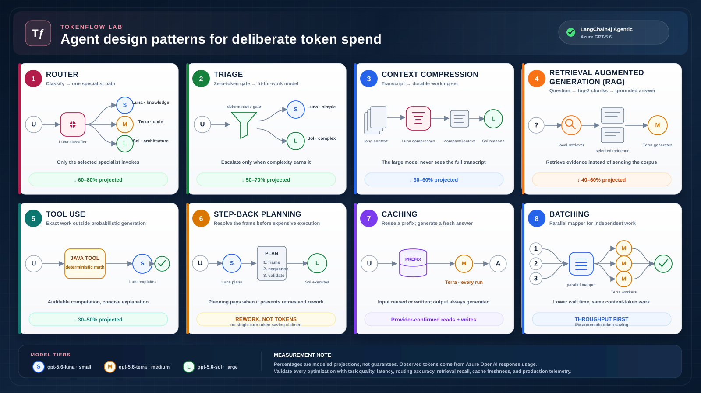
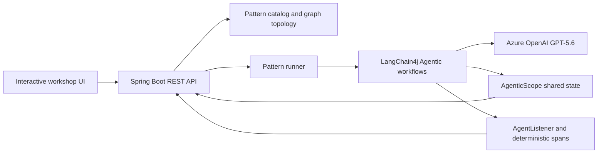
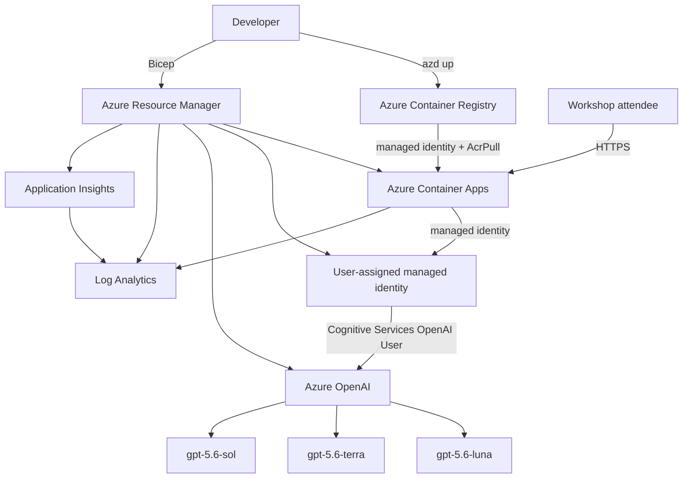

# TokenFlow Lab

**An interactive LangChain4j Agentic workshop for designing AI flows that spend tokens deliberately.**

TokenFlow Lab turns eight token-efficiency patterns into runnable workflows, animated execution graphs, shared-state inspection, and honest token/latency measurements. It is designed for live developer sessions: every pattern has a sample prompt, visual trace, and teaching notes.

> The application runs against Azure OpenAI GPT-5.6 through managed identity. Configure an endpoint and deployments before starting it.



The overview deliberately labels savings as projections. Step-back planning and batching claim **no single-turn token saving**: step-back is judged by rework avoided and batching by throughput, matching the implemented workflows.

## Contents

- [Why this lab exists](#why-this-lab-exists)
- [Patterns](#patterns)
- [Quick start](#quick-start)
- [Models](#models)
- [Workshop walkthrough](#workshop-walkthrough)
- [Application architecture](#application-architecture)
- [Azure architecture](#azure-architecture)
- [Deploy with azd](#deploy-with-azd)
- [Operate the Azure deployment](#operate-the-azure-deployment)
- [Metrics and claims](#metrics-and-claims)
- [HTTP API](#http-api)
- [Project layout](#project-layout)
- [Testing](#testing)
- [Troubleshooting](#troubleshooting)
- [Versions](#versions)

## Why this lab exists

Agent cost is not solved by one prompt trick. It is an architecture concern involving model selection, context boundaries, deterministic computation, reuse, concurrency, and observability.

This lab helps developers answer four questions for each pattern:

1. **What work should invoke a model at all?**
2. **Which model tier is sufficient for that work?**
3. **What is the smallest useful context for the call?**
4. **What evidence proves the optimization did not reduce quality?**

The UI makes the trade-offs visible:

- animated SVG execution topology;
- model and non-AI agent spans;
- `AgenticScope` state passed between agents;
- provider token usage reported by Azure OpenAI;
- projected baseline versus observed tokens;
- cache-hit and concurrency behavior;
- pattern-specific cautions and validation metrics.

## Patterns

| # | Pattern | LangChain4j implementation | Primary lesson | Validate with |
|---:|---|---|---|---|
| 1 | Router | `sequenceBuilder()` + `conditionalBuilder()` | Send work to the least expensive capable specialist | Routing accuracy and fallback rate |
| 2 | Triage | Non-AI `@Agent` + conditional workflow | Escalate only genuinely complex requests | Escalation precision and task success |
| 3 | Context compression | Sequential workflow | Give expensive reasoning a compact working set | Compression fidelity and tokens per turn |
| 4 | RAG | Non-AI retriever + grounded generator | Retrieve relevant chunks instead of sending the corpus | Retrieval recall and groundedness |
| 5 | Tool use | Deterministic calculator + explainer | Keep exact computation outside the model | Tool correctness and failure handling |
| 6 | Step-back planning | Planner + executor sequence | Reduce wandering and costly retries | Rework avoided and completion rate |
| 7 | Caching | Agentic answerer + official OpenAI Java SDK | Reuse a stable prompt prefix; every run still calls the model | Provider cache reads, writes, bypass, and answer quality |
| 8 | Batching | `parallelMapperBuilder()` | Improve throughput with bounded concurrency | Wall time, throughput, and throttling |

Batching does **not** inherently reduce content tokens, and step-back planning *adds* tokens to the turn it runs in. The lab reports both as zero-saving patterns and measures them by throughput and rework avoided instead.

Provider prompt caching also reports zero content-token avoidance. Cached input remains part of observed usage; reuse affects input-processing work and pricing, not whether an answer is generated.

## Quick start

### Prerequisites

- Java 21 or later
- An Azure OpenAI endpoint with the three GPT-5.6 deployments
- Maven is optional because the wrapper is included

### Windows PowerShell

```powershell
$env:AZURE_OPENAI_ENDPOINT="https://your-resource.openai.azure.com/"
$env:AZURE_OPENAI_USE_MANAGED_IDENTITY="true"
.\mvnw.cmd spring-boot:run
```

### macOS or Linux

```bash
export AZURE_OPENAI_ENDPOINT="https://your-resource.openai.azure.com/"
export AZURE_OPENAI_USE_MANAGED_IDENTITY="true"
./mvnw spring-boot:run
```

Open [http://localhost:8080](http://localhost:8080), select a pattern, and choose **Run pattern**. Use <kbd>Ctrl</kbd>+<kbd>Enter</kbd> or <kbd>⌘</kbd>+<kbd>Enter</kbd> to run from the prompt editor. If no endpoint is configured, the UI reports it and disables the run button.

## Models

The lab uses three Azure OpenAI deployments as explicit cost/capability tiers:

| Application tier | Azure deployment | Intended work |
|---|---|---|
| Small | `gpt-5.6-luna` | Routing, triage, compression, and concise tasks |
| Medium | `gpt-5.6-terra` | Standard specialist and batch work |
| Large | `gpt-5.6-sol` | Architecture and deeper reasoning |

The deployed Container App authenticates with a user-assigned managed identity. No Azure OpenAI key is stored in Bicep, Container Apps, or the browser.

Model calls use the official `com.openai:openai-java` SDK against Azure's `/openai/v1/` endpoint, behind a text `ChatModel` adapter. LangChain4j Agentic still orchestrates the workflows. The legacy LangChain4j Azure adapter is not used: it discarded provider cache details. Managed identity uses a refreshing bearer-token supplier rather than a token captured at startup.

For local testing, grant the signed-in developer `Cognitive Services OpenAI User`, sign in with Azure CLI, and set:

```powershell
az login
$env:AZURE_OPENAI_ENDPOINT="https://your-resource.openai.azure.com/"
$env:AZURE_OPENAI_USE_MANAGED_IDENTITY="true"
$env:TOKEN_PATTERNS_SMALL_MODEL="gpt-5.6-luna"
$env:TOKEN_PATTERNS_MEDIUM_MODEL="gpt-5.6-terra"
$env:TOKEN_PATTERNS_LARGE_MODEL="gpt-5.6-sol"
.\mvnw.cmd spring-boot:run
```

An API key remains available as a local fallback by setting `OPENAI_API_KEY` and leaving `AZURE_OPENAI_USE_MANAGED_IDENTITY=false`. Keys are server-side only and are never returned by `/api/config`.

## Workshop walkthrough

A suggested 25–35 minute session:

1. **Router** — use a Java question, then an architecture question. Show that only the selected specialist executes.
2. **Triage** — compare the zero-token deterministic gate with the model responder it activates.
3. **Context compression** — inspect `compactContext` and show that the large model never receives the complete incident transcript.
4. **RAG** — compare two retrieved chunks with the complete local corpus.
5. **Tool use** — show that Java performs exact arithmetic while the model only explains the verified result.
6. **Step-back planning** — discuss paying for a short plan to avoid expensive retries and option churn.
7. **Caching** — leave **Use provider prompt cache** checked and run twice. Both runs call Terra and generate fresh answers. Inspect the provider receipt for cache writes and cache reads; a second-call hit is not guaranteed. Uncheck the option and run again to verify bypass without clearing the service-managed cache.
8. **Batching** — send three semicolon-separated requests. Compare elapsed time with token count and reinforce that concurrency is not token reduction.
9. **Challenge the baseline** — replace every projection with provider telemetry and production quality measurements.

## Application architecture


```mermaid
flowchart LR
    Browser[Interactive workshop UI] --> API[Spring Boot REST API]
    API --> Catalog[Pattern catalog and graph topology]
    API --> Runner[Pattern runner]
    Runner --> Agentic[LangChain4j Agentic workflows]
    Agentic --> AzureModels[Azure OpenAI GPT-5.6]
    Agentic --> Scope[AgenticScope shared state]
    Agentic --> Trace[AgentListener and deterministic spans]
    Scope --> API
    Trace --> API
```

Each HTTP request creates a new workflow and trace collector. Agent outputs are written to `AgenticScope` keys such as `route`, `compactContext`, `plan`, `context`, and `answer`; downstream agents consume those keys by name.

## Azure architecture


```mermaid
flowchart TB
    Developer[Developer] -->|azd up| ACR[Azure Container Registry]
    Developer -->|Bicep| ARM[Azure Resource Manager]
    ARM --> ACA[Azure Container Apps]
    ARM --> Identity[User-assigned managed identity]
    ARM --> AOAI[Azure OpenAI]
    ARM --> Logs[Log Analytics]
    ARM --> AppI[Application Insights]
    ACR -->|managed identity + AcrPull| ACA
    ACA -->|managed identity| Identity
    Identity -->|Cognitive Services OpenAI User| AOAI
    AOAI --> Luna[gpt-5.6-luna]
    AOAI --> Terra[gpt-5.6-terra]
    AOAI --> Sol[gpt-5.6-sol]
    ACA --> Logs
    AppI --> Logs
    User[Workshop attendee] -->|HTTPS| ACA
```

The Bicep deployment creates:

| Resource | Configuration |
|---|---|
| Azure Container App | External HTTPS ingress, port 8080, 0–2 replicas, health probes |
| Container Apps environment | Consumption-only environment with Log Analytics |
| Azure Container Registry | Basic SKU, admin credentials disabled |
| User-assigned managed identity | Shared by ACR image pull and model access |
| Azure OpenAI | Local authentication disabled; managed identity required |
| GPT-5.6 deployments | Version `2026-07-09`, `GlobalStandard`, capacity 100 each |
| Log Analytics | 30-day retention |
| Application Insights | Workspace-based telemetry resource |

The managed identity receives only:

- `AcrPull` scoped to the registry;
- `Cognitive Services OpenAI User` scoped to the Azure OpenAI account.

The deployment principal can optionally receive `Cognitive Services OpenAI User` for local smoke testing by setting `AZURE_PRINCIPAL_ID`.

## Deploy with azd

### Azure prerequisites

- Azure CLI authenticated with `az login`
- Azure Developer CLI authenticated with `azd auth login`
- Permission to create resource groups, role assignments, Container Apps, ACR, monitoring resources, and Azure OpenAI deployments
- GPT-5.6 model availability and quota in the selected region

The verified dev target uses East US 2. Before choosing a different region, check all three models and the subscription quota:

```powershell
$subscriptionId = az account show --query id -o tsv

az cognitiveservices model list `
  --subscription $subscriptionId `
  --location eastus2 `
  --query "[?model.name=='gpt-5.6-luna' || model.name=='gpt-5.6-terra' || model.name=='gpt-5.6-sol'].{name:model.name,version:model.version,skus:model.skus[].name}" `
  --output table

az cognitiveservices usage list `
  --subscription $subscriptionId `
  --location eastus2 `
  --query "[?contains(name.value, 'gpt-5.6')].{name:name.value,current:currentValue,limit:limit}" `
  --output table
```

### First deployment

```powershell
az login
azd auth login

$subscriptionId = az account show --query id -o tsv
$principalId = az ad signed-in-user show --query id -o tsv

azd env new dev --subscription $subscriptionId --location eastus2
azd env set AZURE_RESOURCE_GROUP rg-tokenflow-dev
azd env set AZURE_PRINCIPAL_ID $principalId

# Optional, but recommended before applying changes
azd provision --preview --no-prompt

# Provision, remotely build in ACR, and deploy
azd up --no-prompt
```

Remote ACR builds mean local Docker is not required. The multi-stage `Dockerfile` compiles with Java 21 and runs as a non-root user.

### Useful outputs

```powershell
azd env get-values
azd env get-value AZURE_CONTAINER_APP_URL
azd env get-value AZURE_OPENAI_ENDPOINT
```

`AZURE_CONTAINER_APP_URL` is the deployed workshop URL. Read it from the selected environment rather than reusing a URL from a previous provision, because the resource token changes whenever the environment is recreated.

The dev Container App may be intentionally stopped. A `404` from that URL with no active revision is expected; use the start procedure below.

## Operate the Azure deployment

The examples derive names from the current azd environment instead of hard-coding them.

### Show status

```powershell
$resourceGroup = azd env get-value AZURE_RESOURCE_GROUP
$app = azd env get-value AZURE_CONTAINER_APP_NAME

az containerapp show `
  --resource-group $resourceGroup `
  --name $app `
  --query "{provisioning:properties.provisioningState,fqdn:properties.configuration.ingress.fqdn,latestRevision:properties.latestRevisionName}" `
  --output table

az containerapp revision list --all `
  --resource-group $resourceGroup `
  --name $app `
  --output table
```

### Stop serving the app without deleting resources

The current Container Apps CLI has no app-level `stop` command. Deactivate the active revision:

```powershell
$resourceGroup = azd env get-value AZURE_RESOURCE_GROUP
$app = azd env get-value AZURE_CONTAINER_APP_NAME
$revision = az containerapp revision list `
  --resource-group $resourceGroup `
  --name $app `
  --query "[?properties.active].name | [0]" `
  --output tsv

if ($revision) {
  az containerapp revision deactivate `
    --resource-group $resourceGroup `
    --name $app `
    --revision $revision
}
```

This stops the replicas and endpoint traffic but preserves the Container App, ACR image, identity, logs, and GPT-5.6 deployments.

### Start the stopped revision without rebuilding

```powershell
$resourceGroup = azd env get-value AZURE_RESOURCE_GROUP
$app = azd env get-value AZURE_CONTAINER_APP_NAME
$revision = az containerapp revision list --all `
  --resource-group $resourceGroup `
  --name $app `
  --query "sort_by(@, &properties.createdTime)[-1].name" `
  --output tsv

az containerapp revision activate `
  --resource-group $resourceGroup `
  --name $app `
  --revision $revision
```

### Deploy code changes

```powershell
azd deploy web --no-prompt
```

### Reconcile infrastructure and deploy

```powershell
azd up --no-prompt
```

### View application logs

```powershell
$resourceGroup = azd env get-value AZURE_RESOURCE_GROUP
$app = azd env get-value AZURE_CONTAINER_APP_NAME

az containerapp logs show `
  --resource-group $resourceGroup `
  --name $app `
  --type console `
  --tail 100 `
  --format text
```

### Delete the Azure environment

Stopping the revision does not delete ACR storage, logs, Azure OpenAI deployments, or other resources. To remove the full environment:

```powershell
azd down --purge --force --no-prompt
```

Review the target subscription and environment before running this destructive command.

## Metrics and claims

- **Observed tokens** are read from each `ChatResponse` using Azure OpenAI response usage.
- **Modeled baseline** is the projected cost of an equivalent monolithic large-model or repeated full-context path. It is not provider billing data.
- **Avoided tokens** equal the modeled baseline minus observed tokens.
- **Caching** uses a useful shared reliability policy of more than 1,024 tokens followed by the current question. Only the system prefix has an explicit cache breakpoint; a stable versioned cache key helps routing. The API receives `cachedInputTokens`, `cacheWriteTokens`, and `reasoningTokens` from provider usage. Missing optional fields are `null` (unknown), not invented zeros.
- **Cache status** is `hit` when the provider reports reused input, `miss-written` when it reports writes without reads, `miss` when both counts are zero with caching enabled, `bypassed` when both are zero with caching disabled, or `unknown` when evidence is incomplete. A hit can also include writes.
- **Cache animation** replays the provider receipt after the response arrives; it is not a live stream of Azure's internal operations. The HIT and MISS branches both lead through Terra to a fresh answer. The dashed return-to-cache path lights only when `cacheWriteTokens > 0`, including mixed read/write hits. Bypass skips the cache, and unknown telemetry lights neither outcome branch. These visual stages do not create extra agents, trace events, or model calls. A vertical layout keeps the diagram readable on mobile; reduced motion shows the same confirmed result without animated movement.
- **No answer cache** remains. Every caching run calls the provider. Cached reads and writes are subsets of input, and reasoning is a subset of output; these counts are not added twice or subtracted from observed usage. The caching baseline equals observed usage, so avoided tokens and projected savings stay zero. The UI's **Input reused** percentage is cached input divided by observed input, not a price discount.
- **Cache cost and retention** are service-managed. Cache writes can carry a premium, so the lab does not invent a dollar saving. Enabling caching does not guarantee a hit. Disabling it sends explicit mode without a breakpoint; it bypasses caching rather than invalidating prior entries. Other patterns explicitly bypass caching so their measurements do not depend on hidden cache reuse.
- **Batching** reports zero content-token savings. Its primary measurements are elapsed time and concurrency.
- **Tool use** may improve correctness and auditability even when immediate token savings are modest.
- **Step-back planning** reports zero single-turn savings because planning *adds* tokens to the current request. Its projected baseline equals observed usage, and the run reports the measured plan size against the answer it framed. Judge it by retries and rework avoided across turns.

For production decisions, pair token telemetry with task success, latency, routing accuracy, retrieval recall, groundedness, cache freshness, and provider cost data.

## HTTP API

| Method | Path | Purpose |
|---|---|---|
| `GET` | `/api/patterns` | Pattern descriptions and graph definitions |
| `GET` | `/api/config` | Runtime capabilities and model names; never returns secrets |
| `POST` | `/api/runs` | Execute one pattern |
| `DELETE` | `/api/cache` | Retired: returns `410 Gone`; Azure's prompt cache cannot be cleared by this application |

`POST /api/runs` returns `400` for an unknown pattern or empty input, `429` when Azure OpenAI throttles the run, and `502` when the model provider fails for another reason. All failures use `ProblemDetail`.

Batching accepts one to six non-empty items separated by semicolons or newlines. A single item makes one model call; the application never invents extra tasks. More than six items, or separators without any content, return `400` before model initialization instead of silently dropping work. The sample names LLM routing explicitly to avoid confusion with HTTP routing.

The complex triage responder produces a bounded recommendation in at most 150 words: Decision frame, Next step, and Validation. The completion budget remains 2,000 tokens, including reasoning. A truncated or filtered response is still a failure. Provider errors are classified through the Agentic cause chain, so the UI receives actionable messages for output limits, authentication, throttling, and other failures rather than a reflection-wrapper method signature. Logs retain sanitized categories and numeric usage, not prompts or credentials.

For `patternId: "caching"`, optional `cacheEnabled` defaults to `true`; send `false` to bypass cache reads and writes on that call. The flag does not enable caching on other patterns. The former local `metrics.cacheHit` boolean was removed; clients should use the provider-derived `metrics.cacheStatus`. Aggregate metrics now include input/output counts and nullable provider cache/reasoning counts. Each model trace span carries the same provider detail fields.

Example request:

```json
{
  "patternId": "router",
  "input": "Why does my Java stream return an empty list after I add a filter?"
}
```

PowerShell smoke test:

```powershell
$baseUrl = "http://localhost:8080"
$body = @{
  patternId = "triage"
  input = "What does HTTP 429 mean?"
} | ConvertTo-Json

Invoke-RestMethod `
  -Uri "$baseUrl/api/runs" `
  -Method Post `
  -ContentType "application/json" `
  -Body $body
```

Provider-cache request:

```json
{
  "patternId": "caching",
  "input": "What is idempotency and why does it matter for retries?",
  "cacheEnabled": true
}
```

## Project layout

```text
.
├── azure.yaml                         # azd service and Bicep configuration
├── Dockerfile                         # Java 21 multi-stage non-root image
├── infra/
│   ├── main.bicep                     # Subscription-scope entry point and outputs
│   ├── main.parameters.json           # azd environment parameter mapping
│   └── resources.bicep                # Container Apps, ACR, identity, monitoring, models
├── src/main/java/com/example/tokenpatterns/
│   ├── agent/
│   │   ├── ModelCatalog.java          # Azure OpenAI model tiers and authentication
│   │   └── PatternAgents.java         # AI and non-AI agent definitions
│   ├── domain/                        # API records and graph definitions
│   ├── service/
│   │   ├── PatternCatalog.java        # Pattern content and topology
│   │   ├── PatternRunner.java         # Agentic workflow composition
│   │   └── TraceCollector.java        # Model callbacks and non-AI spans
│   └── web/PatternController.java     # REST API
├── src/main/resources/static/
│   └── index.html                     # Responsive, dependency-free interactive UI
└── src/test/java/                     # Catalog, workflow, cache, batch, and API tests
```

## Testing

Run the complete suite:

```powershell
.\mvnw.cmd test
```

Run a clean package build before deployment:

```powershell
.\mvnw.cmd clean package
```

The test suite executes all eight workflows against a deterministic stub `ChatModel`, validates the API, confirms that repeated caching runs still make model calls, checks cache-read/write/unknown fixtures, and checks parallel mapper fan-out. Official SDK request and response mapping is tested without Azure, network access, or model credentials. The test fixtures are not a production simulation mode.

The dependency-free animation route tests use Node's built-in test runner (Node 18+); there is no frontend build or package installation:

```powershell
node --test .\scripts\cache-flow.test.mjs
```

They cover HIT, MISS with and without writes, mixed read/write hits, bypass, missing telemetry, inconsistent receipts, and isolation between runs. Browser validation must also check the rendered branch classes, pending/error states, viewport changes, reduced motion, and the return path against both test fixtures and real provider receipts.

The unversioned HTML and JavaScript resources send `Cache-Control: no-cache` so browsers revalidate them after deployments. An already-open page must still be reloaded to use a new UI; no timestamp query strings or forced cache-busting URLs are required.

For a complete real-model browser regression, run `.\scripts\Prepare-PlaywrightSuites.ps1`, load the intended local or Azure URL in Playwright MCP, then use `browser_run_code` with each generated `filename`: `.playwright-mcp\patterns-desktop.js`, `patterns-mobile.js`, `patterns-branches.js`, and `patterns-inputs.js` in that same directory. The wrappers use the shared `testPatterns` function in `scripts/playwright-patterns.mjs`; no test code is served by the application. Separate calls keep the run inside the MCP execution window.

This intentionally makes paid model calls. It covers all eight patterns at desktop and mobile widths, additional router and deep-triage branches, cache bypass, one/six/oversized batches, empty-input feedback, and graph scroll reset. It compares rendered metrics and animated nodes with each actual `/api/runs` response, never mocks provider usage, and returns explicit pass/fail results. Non-2xx responses for invalid batch cases are expected. Every suite must report `failed: 0` and an empty `pageErrors` list.

### Live provider verification

The following smoke test makes **paid, real model calls** against a running application. It checks a cache-enabled run, up to six attempts to observe a genuine provider read, a cache-bypassed run, consistent usage, and useful idempotency answers. It fails if no real read is observed or if bypass reports reads or writes. A pre-warmed prefix can hit immediately; the test never fabricates a cold start or claims to clear Azure's cache. `-AllPatterns` additionally validates every other workflow.

```powershell
.\scripts\Test-ProviderCaching.ps1 -BaseUrl http://localhost:8080 -AllPatterns

# After local validation, preview infrastructure before deploying.
azd provision --preview --environment dev --no-prompt
azd up --environment dev --no-prompt
$settings = azd env get-values --output json | ConvertFrom-Json
.\scripts\Test-ProviderCaching.ps1 -BaseUrl $settings.AZURE_CONTAINER_APP_URL -AllPatterns
```

Also verify the Caching screen at desktop and mobile widths: the toggle must affect the request, the receipt must match API usage, and no cache hit may claim zero model calls. Provider usage and output vary between real runs.

## Troubleshooting

### Deployment succeeds but the site returns "Container App - Unavailable"

Check the app-level `properties.runningStatus`, not just revision health. `azd up` can deploy a healthy revision while preserving an explicitly stopped application. Starting the app is separate from scaling an idle app to zero. With authorization to resume service, use the documented [Container Apps start operation](https://learn.microsoft.com/en-us/rest/api/resource-manager/containerapps/container-apps/start?view=rest-resource-manager-containerapps-2025-07-01); older Azure CLI extensions may not expose an app-level start command. Keep the existing scale settings and wait for `/api/config` readiness before testing. Do not work around a stopped app by raising minimum replicas or activating an old revision.

### The run button is disabled

`/api/config` reports `modelsConfigured: true` only when `AZURE_OPENAI_ENDPOINT` is set and either managed identity or an API key is configured. In Azure, verify the Container App environment variables and identity assignment.

### Azure OpenAI returns 401 or 403

- Confirm `AZURE_OPENAI_USE_MANAGED_IDENTITY=true`.
- Confirm `AZURE_CLIENT_ID` references the assigned user-managed identity.
- Confirm the identity has `Cognitive Services OpenAI User` on the Azure OpenAI account.
- Allow several minutes for a new role assignment to propagate.

### A GPT-5.6 request returns a transient 500

Retry once, then inspect Container App logs. During validation, Luna, Terra, and Sol all completed live managed-identity requests; one Sol request returned a transient provider 500 before succeeding on retry.

### A run returns `429 Model provider rate limit reached`

Azure OpenAI throttled the run. Deployment capacity sets both limits: capacity 10 allows only 10 requests per minute, and a single batching run issues one request per item. Capacity 100 raises this to 100 requests per minute and 100,000 tokens per minute.

```powershell
$resourceGroup = azd env get-value AZURE_RESOURCE_GROUP
az cognitiveservices account deployment list `
  --resource-group $resourceGroup `
  --name <openai-account-name> `
  --query "[].{name:name,capacity:sku.capacity}" `
  --output table
```

Raise `modelCapacity` in `infra/main.bicep` and reprovision, or increase capacity in place when the running app must not be interrupted.

### The endpoint returns 404 after the app was stopped

This is expected when no revision is active. List inactive revisions with `az containerapp revision list --all` and activate the latest revision using the start procedure above.

### Model deployment reports `RequestConflict`

Azure OpenAI can reject simultaneous operations on child model deployments. The Bicep file intentionally serializes Luna → Terra → Sol with `dependsOn`; preserve that ordering.

### Container Apps rejects `workloadProfileName`

This template creates a consumption-only environment. Do not set a workload profile name unless the environment is changed to use workload profiles.

### Remote ACR build differs from a local Maven build

The remote builder starts from an empty dependency cache and reveals missing dependencies. Keep `azure-identity` explicit because the official OpenAI SDK's bearer-token integration uses `DefaultAzureCredential`.

### An error includes both a Client Request ID and GH Request ID

That response is from the GitHub Copilot request layer, not the TokenFlow Container App. TokenFlow API failures are returned from `/api/runs` and appear in Container App console logs.

## Cost and cleanup

- The Container App is configured with `minReplicas: 0`, so idle compute can scale to zero.
- Deactivating its only revision stops serving requests and container compute.
- ACR image storage, retained logs, and other provisioned resources can still incur charges while the app is stopped.
- Azure OpenAI usage is driven by model calls; stop the Container App when the lab is not in use.
- Use `azd down --purge --force --no-prompt` when the complete environment is no longer required.

## Versions

- Java 21
- Spring Boot 4.1.0
- LangChain4j 1.19.0
- LangChain4j Agentic 1.19.0-beta29
- Official OpenAI Java SDK 4.63.1
- GPT-5.6 model version 2026-07-09

The Agentic module is experimental and can change between releases. Keep it pinned and rerun the full test suite during upgrades.
