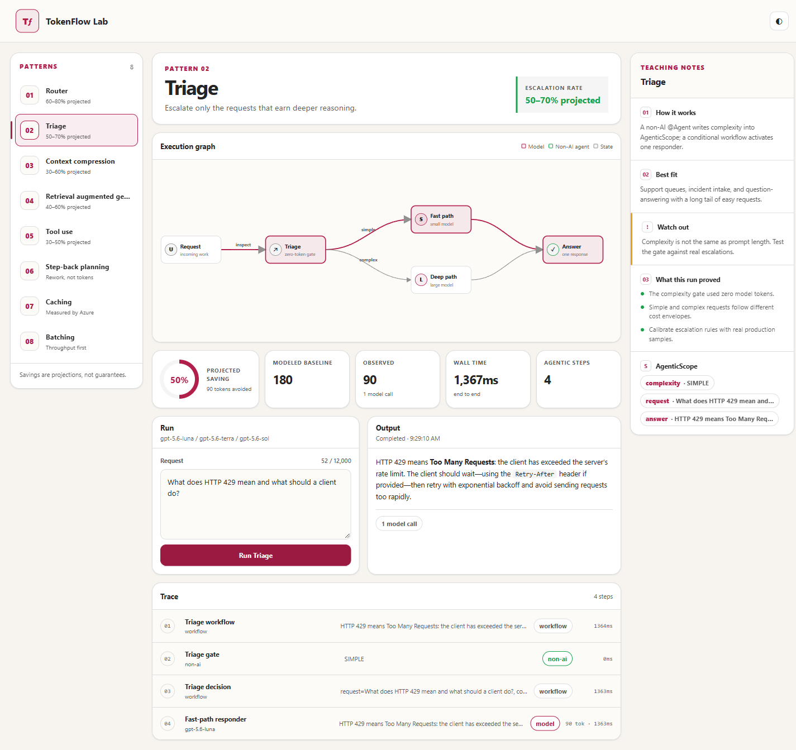
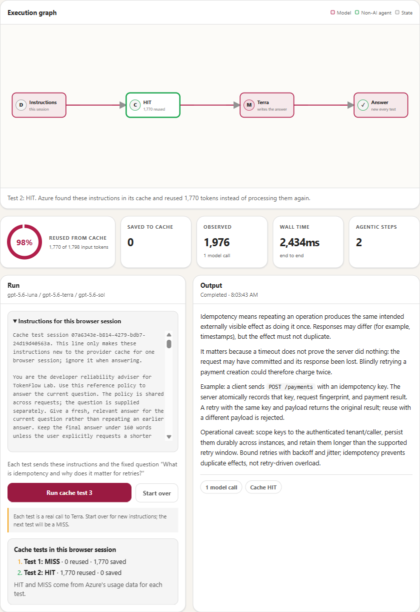

# TokenFlow Lab

TokenFlow Lab is an interactive workshop for eight LLM agent design patterns: routing, triage, context compression, RAG, tool use, step-back planning, prompt caching, and batching. Each run executes a real [LangChain4j Agentic](https://docs.langchain4j.dev/tutorials/agents/) workflow on Azure OpenAI and shows which models it called, how many tokens they used, and the answer they produced.

[](docs/images/tokenflow-lab-desktop.png)

## Contents

- [Quick tour](#quick-tour)
- [The patterns](#the-patterns)
- [How the cache test works](#how-the-cache-test-works)
- [Reading the metrics](#reading-the-metrics)
- [Run locally](#run-locally)
- [Deploy to Azure](#deploy-to-azure)
- [Develop and test](#develop-and-test)
- [Operations and API reference](docs/operations.md)

## Quick tour

Open the running demo then try these four runs:

1. **Triage, simple.** Select **Triage** and run the sample question. A Java rule classifies it without spending tokens, and the small model answers.
2. **Triage, complex.** Replace the question with this prompt and run it again. This time the large model answers.

   ```text
   Design a secure distributed multi-region architecture for a payment system, including migration trade-offs.
   ```

3. **Caching.** Select **Caching**, then **Run cache test 1** and **Run cache test 2**. Test 1 is a MISS, so Azure caches the instructions; test 2 is a HIT, so Azure reuses them. **Start over** begins with new instructions, and the next test misses again.
4. **Batching.** Select **Batching** and run the three sample items. They run in parallel: three model calls and less waiting, but no fewer tokens.

## The patterns

Each pattern has a sample input, an animated execution graph, and teaching notes.

| Pattern | How it works | Try |
|---|---|---|
| **Router** | The small model classifies the request, and only the matching specialist runs | The Java sample, then an architecture question |
| **Triage** | A Java rule sends simple requests to the small model and complex ones to the large model, at no token cost | The sample, then the complex prompt above |
| **Context compression** | The small model condenses a long incident history; the large model answers from the summary | The incident sample |
| **RAG** | Java retrieves the two most relevant local knowledge chunks; the medium model answers from them | The `AgenticScope` sample |
| **Tool use** | Java does the arithmetic; the small model explains the result | The token-cost sample |
| **Step-back planning** | The small model drafts a short plan and the large model follows it; the plan itself adds tokens | The migration sample |
| **Caching** | Azure caches long, stable instructions on the first call and reuses them on the next | Cache test 1, then test 2 |
| **Batching** | One to six independent items, one model call each, run in parallel | The sample, or your own items separated by semicolons or newlines |

A [one-page overview](docs/images/tokenflow-patterns-overview.svg) of all eight patterns is also available.

## How the cache test works

The caching agent sends about 1,770 tokens of instructions that end in an explicit prompt-cache breakpoint, followed by a fixed question. The first line of the instructions is unique to your browser session, so test 1 has nothing to reuse and Azure writes the instructions to its cache. Test 2 sends the same instructions, and Azure reads them back. Only the instructions are cached: every test sends the question again and gets a freshly generated answer.

HIT and MISS come straight from Azure's usage data for each call: `cached_tokens` read and `cache_write_tokens` written. Open **Instructions for this browser session** to see exactly what was sent.

[](docs/images/tokenflow-provider-cache.png)

The lab uses the Responses API because Azure served the cached instructions to test 2 in every trial, whereas with Chat Completions test 2 usually missed ([details](docs/operations.md#provider-caching)). A HIT is still Azure's decision; if test 2 ever misses, run test 3.

## Reading the metrics

| Metric | Meaning |
|---|---|
| **Observed** | Input plus output tokens, as reported by Azure |
| **Modeled baseline** and **Projected saving** | An estimate of what one large-model call with all the context would use; modeled, not measured |
| **Reused from cache** | For caching, the share of input tokens Azure read from its cache |
| **Saved to cache** | For caching, the input tokens Azure stored for reuse |
| **Wall time** | End-to-end time for the run |
| **Agentic steps** | Workflow and agent invocations, including zero-token Java steps |

Reasoning tokens, shown in the trace, are part of the output tokens rather than extra. Step-back planning and batching always show a 0% projected saving: their benefits, less rework and less waiting, don't reduce the tokens in a single run.

## Run locally

You need Java 21+, Git, an Azure OpenAI resource with the three [model deployments](#model-tiers), and an Azure CLI sign-in with the **Cognitive Services OpenAI User** role on that resource. Maven is optional because the wrapper is included.

On Windows PowerShell, replace the endpoint with your own:

```powershell
git clone https://github.com/roryp/token-design-patterns.git
Set-Location token-design-patterns
az login

$env:AZURE_OPENAI_ENDPOINT = "https://your-resource.openai.azure.com/"
$env:AZURE_OPENAI_USE_MANAGED_IDENTITY = "true"
.\mvnw.cmd spring-boot:run
```

<details>
<summary>macOS / Linux</summary>

```bash
git clone https://github.com/roryp/token-design-patterns.git
cd token-design-patterns
az login

export AZURE_OPENAI_ENDPOINT="https://your-resource.openai.azure.com/"
export AZURE_OPENAI_USE_MANAGED_IDENTITY="true"
sh ./mvnw spring-boot:run
```

</details>

Then open [localhost:8080](http://localhost:8080). Authentication uses `DefaultAzureCredential`: your Azure CLI sign-in locally and managed identity in Azure. Keys and tokens stay on the server.

### Model tiers

| Tier | Default deployment | Used for |
|---|---|---|
| Small | `gpt-5.6-luna` | Routing and knowledge answers, simple triage, compression, tool explanations, step-back plans |
| Medium | `gpt-5.6-terra` | Code answers, RAG answers, caching, batch items |
| Large | `gpt-5.6-sol` | Architecture answers, complex triage, answers from compressed context, plan execution |

To use other deployment names or an API key, see [configuration](docs/operations.md#configuration).

## Deploy to Azure

For a first deployment, follow the [setup steps](docs/operations.md#first-deployment) for permissions, model quota, and environment creation. After that, deploy with:

```powershell
azd provision --preview
azd up
azd env get-value AZURE_CONTAINER_APP_URL
```

The app runs as a non-root Java 21 container on Azure Container Apps with managed identity, HTTPS, health probes, and scale-to-zero. ACR builds the image remotely, so you don't need Docker. If the app was explicitly stopped, `azd up` may not start it; see [start and stop](docs/operations.md#start-and-stop). To avoid ongoing charges, see [cost and cleanup](docs/operations.md#cost-and-cleanup).

## Develop and test

```powershell
.\mvnw.cmd clean package
```

On macOS/Linux, run `sh ./mvnw clean package`. The tests use stub models, so they need no Azure access. Live checks make paid calls; the [verification guide](docs/operations.md#verification) covers the API smoke test and the Playwright suites.

### Code map

| File | What it does |
|---|---|
| [PatternAgents.java](src/main/java/com/example/tokenpatterns/agent/PatternAgents.java) | Prompts and deterministic Java agents |
| [PatternRunner.java](src/main/java/com/example/tokenpatterns/service/PatternRunner.java) | Builds each workflow and computes its metrics |
| [TraceCollector.java](src/main/java/com/example/tokenpatterns/service/TraceCollector.java) | Records each agent invocation and its provider usage |
| [OfficialSdkChatModel.java](src/main/java/com/example/tokenpatterns/agent/OfficialSdkChatModel.java) | Sends Responses API requests with cache controls and reads usage |
| [CacheInstructions.java](src/main/java/com/example/tokenpatterns/agent/CacheInstructions.java) | Builds the cached instructions for each browser session |
| [index.html](src/main/resources/static/index.html) | The dependency-free web UI |
| [infra/](infra) | Azure resources for `azd` |

**Stack:** Java 21 · Spring Boot 4.1.0 · LangChain4j 1.19.0 · LangChain4j Agentic 1.19.0-beta29 · OpenAI Java SDK 4.63.1. Versions are pinned in [pom.xml](pom.xml); Agentic is experimental, so rerun the tests when upgrading it.
