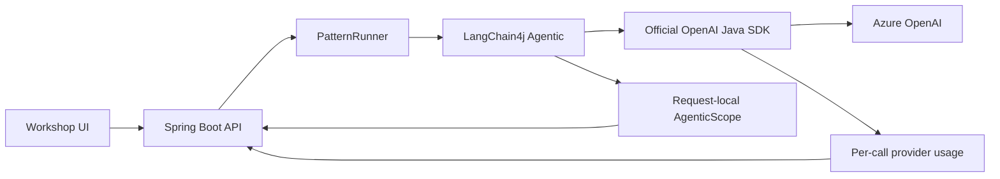
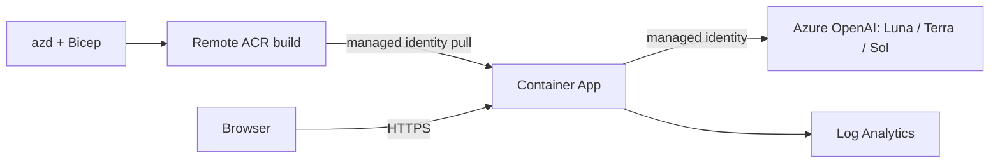

# Operations and API reference

[Back to the README](../README.md)

This guide contains the setup and operational detail behind the live workshop. Examples use PowerShell from the repository root. Read resource names and endpoints from the selected azd environment; do not reuse values from a different deployment.

## Configuration

| Environment variable | Purpose |
|---|---|
| `AZURE_OPENAI_ENDPOINT` | Azure OpenAI resource URL or `/openai/v1/` base URL |
| `AZURE_OPENAI_USE_MANAGED_IDENTITY` | Set `true` to use `DefaultAzureCredential`: local developer credentials or deployed managed identity |
| `AZURE_CLIENT_ID` | User-assigned managed identity client ID; set by Bicep in Azure |
| `OPENAI_API_KEY` | Optional local alternative when the identity option is `false`; never expose it to the browser |
| `TOKEN_PATTERNS_SMALL_MODEL` | Small deployment name; default `gpt-5.6-luna` |
| `TOKEN_PATTERNS_MEDIUM_MODEL` | Medium deployment name; default `gpt-5.6-terra` |
| `TOKEN_PATTERNS_LARGE_MODEL` | Large deployment name; default `gpt-5.6-sol` |

Local identity authentication requires Azure CLI sign-in and `Cognitive Services OpenAI User` on the model resource. The deployed app uses a user-assigned identity and refreshing bearer tokens. Bicep disables Azure OpenAI local-key authentication and ACR admin credentials.

The app expects GPT-5.6-compatible model and explicit prompt-cache capabilities. Custom deployment names must refer to compatible deployments, not merely similarly named older models. The default deployed model version is `2026-07-09`.

## HTTP API

| Method | Path | Contract |
|---|---|---|
| `GET` | `/api/patterns` | Eight pattern definitions, samples, and graph topologies |
| `GET` | `/api/config` | `modelsConfigured`, `models`, and `agenticVersion`; no secrets |
| `GET` | `/api/cache-policy` | The exact, public instructions the caching agent sends. With `?session=<cacheSession>`, that session's first line precedes the shared policy |
| `POST` | `/api/runs` | Execute a real workflow and return output, metrics, trace, and sanitized scope |
| `DELETE` | `/api/cache` | Retired: `410 Gone`; the application cannot clear Azure's prompt cache |

Example:

```json
{
  "patternId": "caching",
  "input": "What is idempotency and why does it matter for retries?",
  "cacheSession": "3f0c2a9e-6b1d-4c7a-9e2f-5d8b1a4c7e60"
}
```

- `patternId` is one of `router`, `triage`, `compression`, `rag`, `tool-use`, `step-back`, `caching`, or `batching`.
- `input` must be nonblank and at most 12,000 characters.
- For caching, `cacheEnabled` defaults to `true`. `false` bypasses reads and writes without invalidating existing provider entries. Other patterns always bypass prompt caching.
- For caching, optional `cacheSession` must be a lowercase version 4 UUID; anything else returns `400` before a model is called. The browser creates one per page load and on **Start over**. Without it, the caching agent sends the shared policy, which earlier requests have probably cached already.
- Batching accepts one to six non-empty semicolon- or newline-separated items. One item means one model call. Empty or oversized batches are rejected before model initialization.
- Tool use reads labeled values, never positions: an input token count, an output token count (`0` or "no output tokens" for none), and both per-million rates, as in `500,000 input tokens and 100,000 output tokens at $0.15/$0.60 per million`. Counts may use commas and `k`, `M`, `B`, or the words thousand, million, and billion; a bare number is a token count. Missing, negative, repeated, or ambiguous values return `400` with the value to state, before model initialization.
- Deep triage requests a recommendation of at most 150 words; the plan executor requests at most 200. The completion budget stays 2,000 tokens, including reasoning. Incomplete responses remain failures.
- Application validation failures return `400`, provider throttling returns `429`, and other model-provider failures return `502`, using `ProblemDetail`. Field validation names the field and rule, for example `input must be at most 12,000 characters.`, without echoing the rejected value. Provider errors are classified through the Agentic cause chain; sanitized messages replace internal reflection-wrapper errors.

### Token and cache fields

`metrics` contains `inputTokens`, `outputTokens`, `observedTokens`, projected-baseline fields, model calls, duration, orchestration steps, concurrency, and nullable `cachedInputTokens`, `cacheWriteTokens`, and `reasoningTokens`. Model trace events include the same provider usage details.

`metrics.cacheEnabled` records the cache option used for this request. The server derives `cacheStatus` from the model call's provider counters, and the page shows HIT or MISS only from that status. Missing telemetry remains unknown. Nothing compares questions or replays a previous run.

| `cacheStatus` | Provider evidence |
|---|---|
| `hit` | Positive cached-input count; writes can also occur |
| `miss-written` | Zero reads and positive writes |
| `miss` | Zero reads and writes with caching enabled |
| `bypassed` | Zero reads and writes with caching disabled |
| `unknown` | Incomplete cache telemetry; missing fields are not treated as zero |

The former application-cache `cacheHit` boolean has been removed. There is no local answer cache.

### Provider caching

The caching agent sends [its instructions](../src/main/java/com/example/tokenpatterns/agent/CacheInstructions.java) as the only leading system input, with an explicit `prompt_cache_breakpoint` at their end, the key `tokenflow-policy-v1`, and `prompt_cache_options: {mode: explicit, ttl: 30m}`. The instructions are the browser session's line followed by the shared [reliability policy](../src/main/resources/prompts/cache-policy.txt), which is longer than 1,024 tokens. The fixed question follows the breakpoint, so it is never part of the cached prefix.

- **Test 1 misses.** The session line makes the whole prefix new, so Azure reports `cached_tokens: 0` and writes it (`cache_write_tokens` of about 1,770).
- **Test 2 hits.** Azure reads the same prefix back (`cached_tokens` of about 1,770 and `cache_write_tokens: 0`). Terra still generates a fresh answer.
- **Start over** creates a new session, so the next test misses again.

Every model call uses the Responses API (`/openai/v1/responses` with `store: false`). In interleaved trials against the GlobalStandard GPT-5.6 deployments on September 24, 2026, test 2 hit in 21 of 21 Responses API sessions but in only 11 of 48 Chat Completions sessions, whose requests reached replicas that did not have the written prefix. Per-session cache keys, pauses of up to 10 seconds, and `prompt_cache_retention: 24h` did not change the Chat Completions result. A HIT remains the provider's decision, so the page reports each result as returned.

`/api/cache-policy` serves these instructions publicly. Do not put secrets or private instructions in the workshop policy.

Cached reads and writes are subsets of input. Reasoning is a subset of output. Do not subtract them from observed usage or add them twice. Cache writes may carry a premium. Projected baselines are modeled comparisons, not provider billing data. Caching, batching, and step-back planning keep their projected baseline equal to observed usage and claim no single-run content-token avoidance.

## Implementation



Each request gets its own workflow and trace collector. Agent outputs use named scope keys such as `route`, `complexity`, `compactContext`, `context`, `plan`, and `answer`. Deterministic Java agents perform routing gates, retrieval, and arithmetic without model reasoning.

The [SDK adapter](../src/main/java/com/example/tokenpatterns/agent/OfficialSdkChatModel.java) sends typed Responses API requests and maps provider usage from `input_tokens_details` and `output_tokens_details`. It does not scrape logs or infer cache hits from latency. The [UI](../src/main/resources/static/index.html) replays completed traces; animation never adds model calls or synthetic trace events.

## Azure architecture



| Resource | Default configuration |
|---|---|
| Container App | External HTTPS, port 8080, `/api/config` probes, 0–2 replicas, non-root Java 21 |
| Container Apps environment | Consumption-only, linked to Log Analytics |
| ACR | Basic SKU, admin credentials disabled, remote builds |
| Managed identity | `AcrPull` on ACR and `Cognitive Services OpenAI User` on Azure OpenAI |
| Azure OpenAI | Local authentication disabled; three GPT-5.6 deployments |
| Model deployments | Version `2026-07-09`, `GlobalStandard`; per-model capacities below |
| Monitoring | Log Analytics with 30-day retention and a workspace-based Application Insights resource |

Resources are declared in [main.bicep](../infra/main.bicep) and [resources.bicep](../infra/resources.bicep). `azure-identity` must remain an explicit dependency: remote builds start without the local Maven cache.

The Bicep defaults preserve the workshop capacities observed in Azure on September 24, 2026:

| Deployment | Bicep parameter | Capacity units | Reported tokens/minute | Reported requests/minute |
|---|---|---:|---:|---:|
| Luna | `smallModelCapacity` | 1,028 | 1,028,000 | 1,028 |
| Terra | `mediumModelCapacity` | 1,001 | 1,001,000 | 1,001 |
| Sol | `largeModelCapacity` | 1,001 | 1,001,000 | 1,001 |

These are allocation/rate limits, not usage or a guarantee of latency. The old shared `modelCapacity` parameter has been replaced so each model's allocation can be preserved independently. For a new environment, review available quota and set the per-model parameters deliberately; do not assume another subscription has this capacity. Avoid portal-only changes that a later template deployment could overwrite.

## First deployment

You need Azure CLI, Azure Developer CLI, and permission to create the resources and role assignments above. Verify availability and quota for **all three models** in the selected subscription and region before provisioning. East US 2 is the workshop's validated region, not a guarantee of capacity in every subscription.

For a **new** environment:

```powershell
az login
azd auth login

$subscriptionId = az account show --query id --output tsv
$principalId = az ad signed-in-user show --query id --output tsv
$environment = "conference"

azd env new $environment --subscription $subscriptionId --location eastus2
azd env set AZURE_RESOURCE_GROUP "rg-tokenflow-$environment"
azd env set AZURE_PRINCIPAL_ID $principalId

azd provision --preview
azd up
azd env get-value AZURE_CONTAINER_APP_URL
```

Review the subscription and preview before applying. `AZURE_PRINCIPAL_ID` optionally grants the signed-in developer model access for local tests. Choose a distinct environment/resource group rather than replacing an existing workshop environment.

For an existing environment, use `azd env select <name>`, validate locally, preview with `azd provision --preview`, then run `azd up`. For application-only changes, `azd deploy web` is also available. Remote ACR builds mean Docker is not required locally.

## Verification

### Credential-free checks

```powershell
.\mvnw.cmd clean package
```

Use `sh ./mvnw clean package` on macOS/Linux. Java tests use `StubChatModel` through `StubModelConfiguration` and mocked SDK responses; they do not call Azure. Test stubs are not a production fallback.

### Live API checks — paid model calls

```powershell
.\scripts\Test-ProviderCaching.ps1 -BaseUrl http://localhost:8080 -AllPatterns

$settings = azd env get-values --output json | ConvertFrom-Json
.\scripts\Test-ProviderCaching.ps1 -BaseUrl $settings.AZURE_CONTAINER_APP_URL -AllPatterns
```

The script validates usage, answers, and the other workflows. With a new cache session, test 1 must MISS and write at least 1,024 tokens, and one of the next five tests must HIT with at least 1,024 cached tokens; the summary names the test that hit. A bypassed request on the now-cached prefix must then read and write nothing. The script never fabricates a cold cache or claims to clear provider state.

### Playwright MCP checks — paid model calls

1. Run `.\scripts\Prepare-PlaywrightSuites.ps1`.
2. Open the intended local or Azure app in Playwright MCP.
3. Use the `browser_run_code` tool's `filename` option once for each generated file:
   - `.playwright-mcp\patterns-desktop.js`
   - `.playwright-mcp\patterns-mobile.js`
   - `.playwright-mcp\patterns-branches.js`
   - `.playwright-mcp\patterns-inputs.js`
   - `.playwright-mcp\patterns-cache.js`
4. Require `failed: 0` and an empty `pageErrors` list in **each** result.

The shared [suite](../scripts/playwright-patterns.mjs) checks all eight patterns at both widths, additional routing and triage paths, provider-cache behavior, batch limits, keyboard submission, empty-input feedback, and graph reset. Every answer must render its Markdown: no raw code fences, and numbered steps keep the numbers the model wrote. The branch suite also checks that a short definition mentioning architecture stays on the fast path and that a question about parallel work retrieves the parallel entries. The cache suite checks that caching shows no prompt box and that the dropdown matches the instructions the server sends. Test 1 must MISS and write, test 2 should HIT (the result reports `test2Hit`; up to test 6 is accepted), and **Start over** must produce a new session whose first test misses again. Every cache test must show the provider's result on the graph, in the history, and on the answer badge. The input suite covers comma-separated and negative token counts, a failed run clearing the previous run's results, and the message for input over 12,000 characters. The suites compare UI metrics and animations with actual responses and never intercept or mock provider requests. The input suite deliberately produces `400` responses for invalid batches, a negative token count, and oversized input.

After deployment, wait until the intended revision is ready and refresh the page. Unversioned UI resources send `Cache-Control: no-cache`; an already-open document still needs reloading.

## Status and logs

Load only the selected environment into shell variables; do not print credentials:

```powershell
$settings = azd env get-values --output json | ConvertFrom-Json
$subscription = $settings.AZURE_SUBSCRIPTION_ID
$resourceGroup = $settings.AZURE_RESOURCE_GROUP
$app = $settings.AZURE_CONTAINER_APP_NAME

az containerapp show --subscription $subscription --resource-group $resourceGroup --name $app `
  --query "{state:properties.provisioningState,running:properties.runningStatus,latest:properties.latestRevisionName,ready:properties.latestReadyRevisionName}" `
  --output table

az containerapp revision list --subscription $subscription --resource-group $resourceGroup --name $app `
  --query "[?properties.active].{name:name,health:properties.healthState,running:properties.runningState,traffic:properties.trafficWeight}" `
  --output table

az containerapp logs show --subscription $subscription --resource-group $resourceGroup --name $app `
  --type console --tail 100 --format text
```

## Start and stop

An **explicitly stopped app** is different from an idle app that has scaled to zero. `azd up` can deploy a healthy revision while leaving the app-level state stopped. Inspect `properties.runningStatus`; do not activate an arbitrary old revision or raise minimum replicas to work around it.

Older CLI extensions may not expose app-level commands. The documented ARM [start](https://learn.microsoft.com/en-us/rest/api/resource-manager/containerapps/container-apps/start?view=rest-resource-manager-containerapps-2025-07-01) and [stop](https://learn.microsoft.com/en-us/rest/api/resource-manager/containerapps/container-apps/stop?view=rest-resource-manager-containerapps-2025-07-01) operations are available. Run only the operation you intend, with authorization to change availability.

Using the variables from [status and logs](#status-and-logs), resolve the exact app:

```powershell
$resourceId = az containerapp show --subscription $subscription --resource-group $resourceGroup `
  --name $app --query id --output tsv
if ($LASTEXITCODE -ne 0) { throw "Could not resolve the selected Container App." }
```

**Start:**

```powershell
az rest --method post `
  --url "https://management.azure.com${resourceId}/start?api-version=2025-07-01" `
  --output none
```

Wait for the app to become ready, then check `$settings.AZURE_CONTAINER_APP_URL + "/api/config"`. A start operation may be asynchronous.

**Stop:**

```powershell
az rest --method post `
  --url "https://management.azure.com${resourceId}/stop?api-version=2025-07-01" `
  --output none
```

Stopping preserves resources and existing scale settings. It does not eliminate ACR storage, retained logs, or other resource charges.

## Troubleshooting

| Symptom | Check |
|---|---|
| Run button disabled | Endpoint and authentication configuration; `/api/config` should report `modelsConfigured: true` |
| Provider `401` / `403` | Identity selection, resource-level `Cognitive Services OpenAI User`, and role propagation; `AZURE_CLIENT_ID` identifies the deployed user-assigned identity |
| Provider `429` | Request/token quota and concurrency; batching makes a call per item. Check the actual deployment's limits rather than assuming a universal capacity-to-RPM ratio |
| Provider `502` or response-token-limit message | Read the actionable error, narrow the task if it exhausted its budget, and inspect sanitized logs; never treat a partial answer as success |
| Platform `404` after deployment | App-level stopped state versus revision readiness; use [start and stop](#start-and-stop) |
| Old frontend after deployment | Confirm the new revision is ready, then reload the browser |
| Test 1 reports HIT | A new session cannot hit: its first line makes the prefix new. Reload the page after deployment and check that the run request carries `cacheSession` |
| Test 2 reports MISS | Run test 3; a HIT is the provider's decision. Check that the deployment is Standard pay-as-you-go GPT-5.6 (PTU does not support breakpoints) and that requests use the Responses API |
| Model deployment `RequestConflict` | Keep the Bicep Luna → Terra → Sol deployment dependencies |
| Rejected `workloadProfileName` | This template is consumption-only; do not add a workload profile without changing the environment architecture |
| Remote build differs from local | Rebuild with a clean Maven cache in mind; keep explicit SDK/identity dependencies |

Provider failure logs retain categories, class names, and numeric diagnostic usage rather than prompts or credentials. `Client Request ID` plus `GH Request ID` errors from Copilot tooling are not TokenFlow `/api/runs` responses.

## Cost and cleanup

Scale-to-zero reduces idle app compute, not all Azure charges. Real model calls incur usage charges; watch audience concurrency and quota during a workshop. Use a controlled environment rather than treating this sample as a hardened public, multi-tenant service.

**Destructive:** `azd down` removes the selected environment's resources and data. Verify the target first and answer its confirmation prompts deliberately:

```powershell
azd env list
azd env get-value AZURE_RESOURCE_GROUP
azd down
```

Do not tear down a shared conference environment while attendees still depend on it.
